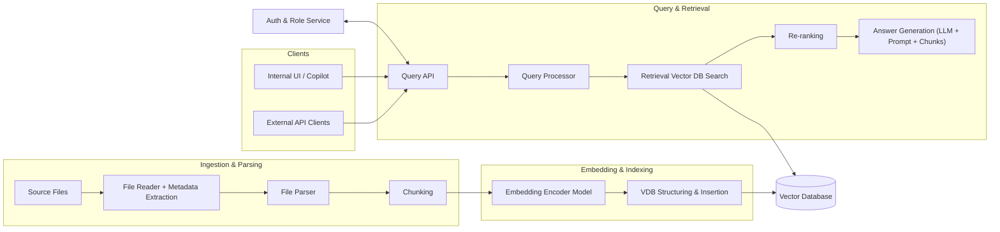

# Architecture Overview

## Overview
This document describes the high-level system architecture for the SMPTE Copilot solution and defines the core modules that compose the system.  
The overall goal is to design each module to be modular, extensible, and easy to evolve over time.

The architecture is structured into three main areas:

- **Ingestion & Parsing**  
- **Embedding & Indexing**  
- **Query & Retrieval**

---
## Architecture Diagram

## Ingestion & Parsing

### File Reader
Responsible for ingesting raw files from configured sources and extracting the baseline metadata required by downstream modules.  
This module abstracts file access and normalization of basic metadata.

### File Parser
Converts ingested files into a normalized text representation (and optionally a structured one) suitable for chunking and embedding.  
It should detect file type and route to the appropriate parsing strategy.

### Chunking
Splits parsed documents into semantically meaningful segments for embedding and retrieval.  
The module must support configurable chunking strategies that can be selected through parameters (e.g., fixed-size, structure-aware, semantic, overlapping windows).

---

## Embedding & Indexing

### Embedding
Transforms document chunks into vector representations.  
The module should support multiple embedding backends and allow configuration of different models or inference providers.

### Vector DB Structuring and Insertion
Structures and persist embeddings and metadata in a vector database optimized for retrieval.

---

## Query & Retrieval

### Query API
Provides an external interface for clients to send queries and receive answers.  

### Query Processor
Coordinates the entire retrieval pipeline.  
Responsible for query normalization, orchestration of retrieval components, and managing configurable behaviors such as rewriting or enrichment.

### Retrieval
Retrieves the most relevant chunks from the vector database.  
This typically involves embedding the user query, performing similarity search, and assembling a candidate set of relevant content.

### Re-Ranking
Refines the initial retrieved results to improve the quality of the final context passed to downstream components.  

### Answer Generation (LLM + Prompt + Chunks)
Generates the final answer for the user using an LLM combined with the selected chunks as contextual input.  

---
