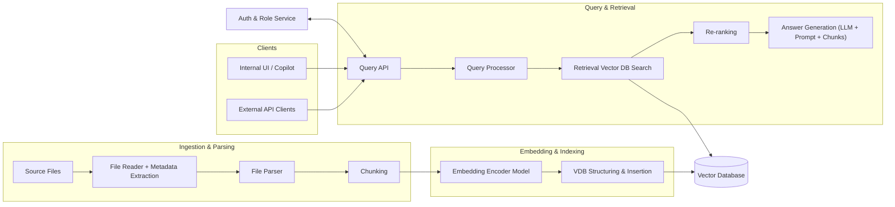

# Architecture

This document describes the architectural patterns and design decisions used in SMPTE-Copilot.

## Table of Contents

- [Architecture Diagram](#architecture-diagram)
- [Architecture Patterns](#architecture-patterns)
  - [Module Architecture](#module-architecture)
  - [Dynamic Factory Pattern with Registry](#dynamic-factory-pattern-with-registry)
- [Pipeline Pattern Architecture](#pipeline-pattern-architecture)
  - [Overview](#overview)
  - [Ingestion Pipeline](#ingestion-pipeline)
  - [Query Pipeline](#query-pipeline)
  - [Pipeline Context](#pipeline-context)
  - [Extensibility: Adding New Steps](#extensibility-adding-new-steps)
  - [Benefits of the Pipeline Pattern](#benefits-of-the-pipeline-pattern)
  - [Pipeline Execution Flow](#pipeline-execution-flow)

## Architecture Diagram



## Architecture Patterns

The project uses two main architectural patterns that enable modularity and extensibility:

1. **Factory Pattern with Dynamic Registry**: For component creation and registration
2. **Pipeline Pattern**: For orchestrating sequential processing steps

### Module Architecture

All main modules (`chunkers`, `embeddings`, `llms`, `loaders`, `retrievers`, `vector_stores`) follow the same architectural structure based on the Factory pattern. This consistency facilitates code understanding and the incorporation of new components.

#### Module Structure (Example: `embeddings/`)

```
embeddings/
├── __init__.py           # Exports main classes and types
├── protocol.py           # Defines the Protocol interface that all components must implement
├── types.py              # Defines the Enum with available types
├── factory.py            # Implements the Factory pattern with dynamic registry
├── constants.py          # Module-specific constants (optional)
├── helpers.py            # Helper functions (optional)
├── huggingface.py        # Specific implementation: HuggingFace embeddings
└── openai.py             # Specific implementation: OpenAI embeddings
```

**Main components:**

1. **`protocol.py`**: Defines a Protocol (interface) that specifies the methods all implementations must provide. This ensures compatibility and allows swapping implementations without changing the rest of the code.

2. **`types.py`**: Contains an Enum that lists all available component types in the module (e.g., `EmbeddingModelType.HUGGINGFACE`, `EmbeddingModelType.OPENAI`).

3. **`factory.py`**: Implements the Factory pattern with a dynamic registry. Allows registering new implementations and creating them by type. The factory maintains a dictionary that maps types to creation functions.

4. **Implementation files** (e.g., `huggingface.py`, `openai.py`): Each file contains a `create_*` function that receives a configuration dictionary and returns an instance that implements the module's Protocol.

5. **`constants.py`**: Defines module-specific constants (default values, metadata keys, etc.).

6. **`__init__.py`**: Exports the main classes, types, and functions of the module to facilitate imports.

### Dynamic Factory Pattern with Registry

The project uses a **dynamic Factory pattern with an internal registry** to enable runtime registration of component implementations. This pattern provides maximum flexibility and extensibility without requiring modifications to the factory class when adding new implementations.

#### How It Works

Each Factory class maintains an internal `_registry` dictionary that maps component types (Enum values) to factory functions:

```python
class EmbeddingModelFactory:
    """Factory for creating embedding models. Easily extensible."""
    # Class variable: shared registry across all instances
    _registry: ClassVar[dict[EmbeddingModelType, Callable[[dict[str, Any]], Embeddings]]] = {}
```

#### Registration Mechanism

The Factory provides a `register` method that acts as a decorator, allowing implementations to be registered dynamically:

```python
@classmethod
def register(cls, model_type: EmbeddingModelType):
    """Register a new embedding model factory.
    Parameters
    ----------
    model_type
        Type to register the model under.
    """
    def decorator(factory_func: Callable[[dict[str, Any]], Embeddings]):
        cls._registry[model_type] = factory_func
        return factory_func
    return decorator
```

#### Registration Process

Implementations are registered at module load time (when the factory module is imported):

```python
# At the end of factory.py
EmbeddingModelFactory.register(EmbeddingModelType.HUGGINGFACE)(create_huggingface_embedding)
EmbeddingModelFactory.register(EmbeddingModelType.OPENAI)(create_openai_embedding)
```

This registration happens automatically when the module is imported, populating the registry before any `create()` calls are made.

#### Creation Process

When `create()` is called, the factory looks up the type in the registry and calls the corresponding factory function:

```python
@classmethod
def create(cls, model_type: EmbeddingModelType, **kwargs) -> Embeddings:
    """Create an embedding model by type."""
    if model_type not in cls._registry:
        available = ", ".join(t.value for t in cls._registry)
        raise ValueError(
            f"Unknown model: {model_type}. "
            f"Available models: {available}"
        )
    return cls._registry[model_type](kwargs)
```

#### Complete Example: EmbeddingModelFactory

```python
class EmbeddingModelFactory:
    """Factory for creating embedding models. Easily extensible."""

    # Internal registry: maps EmbeddingModelType -> factory function
    _registry: ClassVar[dict[EmbeddingModelType, Callable[[dict[str, Any]], Embeddings]]] = {}

    @classmethod
    def register(cls, model_type: EmbeddingModelType):
        """Register a new embedding model factory."""
        def decorator(factory_func: Callable[[dict[str, Any]], Embeddings]):
            cls._registry[model_type] = factory_func
            return factory_func
        return decorator
    @classmethod
    def create(cls, model_type: EmbeddingModelType, **kwargs) -> Embeddings:
        """Create an embedding model by type."""
        if model_type not in cls._registry:
            available = ", ".join(t.value for t in cls._registry)
            raise ValueError(
                f"Unknown model: {model_type}. "
                f"Available models: {available}"
            )
        return cls._registry[model_type](kwargs)

# Register implementations at module load time
EmbeddingModelFactory.register(EmbeddingModelType.HUGGINGFACE)(create_huggingface_embedding)
EmbeddingModelFactory.register(EmbeddingModelType.OPENAI)(create_openai_embedding)
```

#### Benefits of the Registry Pattern

1. **Zero Factory Modification**: Adding a new implementation doesn't require modifying the Factory class
2. **Runtime Flexibility**: Registry is populated at import time, allowing dynamic discovery
3. **Type Safety**: Registry is strongly typed with `ClassVar` and type hints
4. **Error Messages**: Clear error messages listing available types when an unknown type is requested
5. **Testability**: Easy to mock or replace implementations in tests by manipulating the registry
6. **Extensibility**: Third-party code can register new implementations without modifying core code

#### Registry Flow Diagram

```
Module Import
    ↓
Factory class definition loaded
    ↓
Registry dictionary initialized (empty)
    ↓
Registration statements executed
    ↓
Registry populated: {Type1: func1, Type2: func2, ...}
    ↓
Factory.create(Type1, **config) called
    ↓
Lookup Type1 in registry
    ↓
Call registered function: func1(config)
    ↓
Return instance
```

## Pipeline Pattern Architecture

The project uses a **Pipeline Pattern** to orchestrate sequential processing steps. This pattern provides a clean separation of concerns, makes the codebase highly extensible, and allows easy addition of new processing steps without modifying existing code.

### Overview

The pipeline pattern consists of three main components:

1. **Context**: A data structure that holds the state as it flows through the pipeline
2. **Steps**: Individual processing units that transform the context
3. **Executor**: Orchestrates the execution of steps sequentially

### Ingestion Pipeline

The ingestion pipeline (`ingest.py`) processes documents through sequential steps. Each step can be enabled or disabled via configuration (see [Configurable Pipelines](configuration.md#configurable-pipelines)):

```
Load → Preprocess → Chunk → Embed → Save
```

**Pipeline Flow:**

1. **LoadStep**: Converts media files (PDF, images, videos, audio) to Markdown format
   - Input: `file_path` in `IngestionContext`
   - Output: Sets `markdown_path` and `raw_text` in context

2. **PreprocessStep**: Removes repeated headers, footers, and page numbers
   - Input: `raw_text` from LoadStep
   - Output: Updates `raw_text` and `markdown_path` with cleaned content
   - Configurable via `preprocessing` section in `config.yaml`

3. **ChunkStep**: Splits the Markdown text into smaller chunks
   - Input: `markdown_path` from LoadStep/PreprocessStep
   - Output: Sets `chunks` (list of Document objects) in context

4. **EmbeddingGenerationStep**: Generates embeddings for each chunk
   - Input: `chunks` from ChunkStep
   - Output: Updates `chunks` with embeddings in metadata and sets `vectors`

5. **SaveStep**: Stores chunks with embeddings in the vector database
   - Input: `chunks` with embeddings from EmbeddingGenerationStep
   - Output: Persists data to vector store

**Implementation Example:**

```python
from src.pipeline import IngestionContext, PipelineExecutor
from src.pipeline.steps import (
    LoadStep,
    PreprocessStep,
    ChunkStep,
    EmbeddingGenerationStep,
    SaveStep,
)
context = IngestionContext(file_path=file_path)

# Steps are built dynamically based on pipeline configuration
# Only enabled steps are included
steps = []
if config.pipeline.ingestion.load_enabled:
    steps.append(LoadStep(loader))
if config.pipeline.ingestion.preprocess_enabled:
    steps.append(PreprocessStep(preprocessor))
if config.pipeline.ingestion.chunk_enabled:
    steps.append(ChunkStep(chunker))
if config.pipeline.ingestion.save_enabled:
    # Save step includes both embedding generation and database storage
    steps.append(EmbeddingGenerationStep(embedding_model, model_name))
    steps.append(SaveStep(vector_store))

executor = PipelineExecutor(steps)
context = executor.execute(context)
```

### Query Pipeline

The query pipeline (`query.py`) processes user queries through sequential steps. Each step can be enabled or disabled via configuration (see [Configurable Pipelines](configuration.md#configurable-pipelines)):

```
QueryEmbedding → Retrieve → [Rerank] → [AccessControl] → Generate
```

**Pipeline Flow:**

1. **QueryEmbeddingStep**: Generates an embedding vector for the user query
   - Input: `user_query` in `QueryContext`
   - Output: Sets `query_vector` in context

2. **RetrieveStep**: Retrieves relevant documents from the vector store
   - Input: `user_query` (uses query directly, not the vector)
   - Output: Sets `retrieved_docs` (list of tuples with Document and score) in context
   - When `notify_on_denied_access: false`: Applies database-level access control filtering
   - When `notify_on_denied_access: true`: Retrieves all matching documents without filtering

3. **RerankStep** (optional): Reranks retrieved documents using a cross-encoder
   - Only active when `rerank_enabled: true`
   - Input: `retrieved_docs` from RetrieveStep
   - Output: Updates `retrieved_docs` with reordered documents based on cross-encoder relevance scores
   - Improves precision by using more sophisticated relevance assessment

4. **AccessControlStep** (optional): Separates accessible and restricted documents
   - Only active when `notify_on_denied_access: true`
   - Input: `retrieved_docs` from RetrieveStep/RerankStep
   - Output: Updates `retrieved_docs` with only accessible documents, sets `restricted_docs` and `has_restricted_content`

5. **GenerateStep**: Generates a response using an LLM based on the retrieved documents
   - Input: `retrieved_docs` from previous steps
   - Output: Sets `llm_response` and `citations` in context
   - When `has_restricted_content: true`: Appends access denial notification to response

**Implementation Example:**

```python
from src.pipeline import QueryContext, PipelineExecutor
from src.pipeline.steps import (
    QueryEmbeddingStep,
    RetrieveStep,
    RerankStep,
    AccessControlStep,
    GenerationStep,
)

context = QueryContext(user_query=query)

# Steps are built dynamically based on pipeline configuration
# Only enabled steps are included
steps = []
if config.pipeline.query.retrieve_enabled:
    steps.append(QueryEmbeddingStep(embedding_model))
    steps.append(RetrieveStep(retriever))
if config.pipeline.query.rerank_enabled:
    steps.append(RerankStep(reranker))
if config.access_control.notify_on_denied_access:
    steps.append(AccessControlStep())
if config.pipeline.query.generation_enabled:
    steps.append(GenerationStep(llm))

executor = PipelineExecutor(steps)
context = executor.execute(context)
```

### Pipeline Context

Each pipeline uses a context object that extends `PipelineContext`:

- **`IngestionContext`**: Tracks document state through ingestion
  - `file_path`: Path to the source file
  - `markdown_path`: Path to generated Markdown file
  - `chunks`: List of document chunks
  - `vectors`: List of embedding vectors
  - `status`: Pipeline execution status (PENDING, RUNNING, COMPLETED, FAILED)
  - `error`: Error message if pipeline failed

- **`QueryContext`**: Tracks query state through retrieval
  - `user_query`: Original user query string
  - `query_vector`: Embedding vector for the query
  - `retrieved_docs`: Retrieved documents with similarity scores
  - `llm_response`: Generated response from LLM
  - `citations`: List of citations for the response
  - `user_role`: User's role for access control
  - `role_mapping`: Role-to-tags mapping dictionary
  - `restricted_docs`: List of restricted document metadata (when `notify_on_denied_access: true`)
  - `has_restricted_content`: Flag indicating if restricted content was found
  - `status`: Pipeline execution status
  - `error`: Error message if pipeline failed

### Extensibility: Adding New Steps

The pipeline pattern makes it extremely easy to add new processing steps. For example, to add a **re-ranking step** to the query pipeline:

#### Step 1: Create the Re-ranking Step

Create `src/pipeline/steps/rerank_step.py`:

```python
class RerankStep:
    """Step that re-ranks retrieved documents using a re-ranker model."""

    def __init__(self, reranker):
        """Initialize the re-rank step.
        Parameters
        ----------
        reranker
            Re-ranker model instance.
        """
        self.reranker = reranker

    def run(self, context: QueryContext) -> None:
        """Re-rank retrieved documents.
        Parameters
        ----------
        context
            Query context with retrieved_docs set.
        """
        ...
```

#### Step 2: Export the Step

Add to `src/pipeline/steps/__init__.py`:

```python
from .rerank_step import RerankStep
from .access_control_step import AccessControlStep

__all__ = [
    # ... existing steps
    "RerankStep",
    "AccessControlStep",
]
```

#### Step 3: Use in Pipeline

Update `src/cli/query.py`:

```python
from src.pipeline.steps import QueryEmbeddingStep, RetrieveStep, RerankStep

steps = [
    QueryEmbeddingStep(embedding_model),
    RetrieveStep(retriever),
    RerankStep(reranker),  # New step added here
]

executor = PipelineExecutor(steps)
context = executor.execute(context)
```

That's it! The new step is seamlessly integrated into the pipeline. The executor will:
1. Execute steps in order
2. Stop if any step marks the context as failed
3. Handle errors appropriately

### Benefits of the Pipeline Pattern

1. **Modularity**: Each step is independent and can be tested in isolation
2. **Extensibility**: Add new steps without modifying existing code
3. **Flexibility**: Reorder steps or create different pipeline configurations
4. **Error Handling**: Centralized error handling through the executor
5. **State Management**: Context object provides clear state tracking
6. **Composability**: Mix and match steps to create different pipelines

### Pipeline Execution Flow

```
1. Create context with initial data
2. Create list of steps
3. Create PipelineExecutor with steps
4. Execute pipeline:
   - Mark context as RUNNING
   - For each step:
     - Check if context is FAILED (stop if so)
     - Execute step.run(context)
     - Step modifies context
   - If still RUNNING, mark as COMPLETED
5. Return context with final state
```
